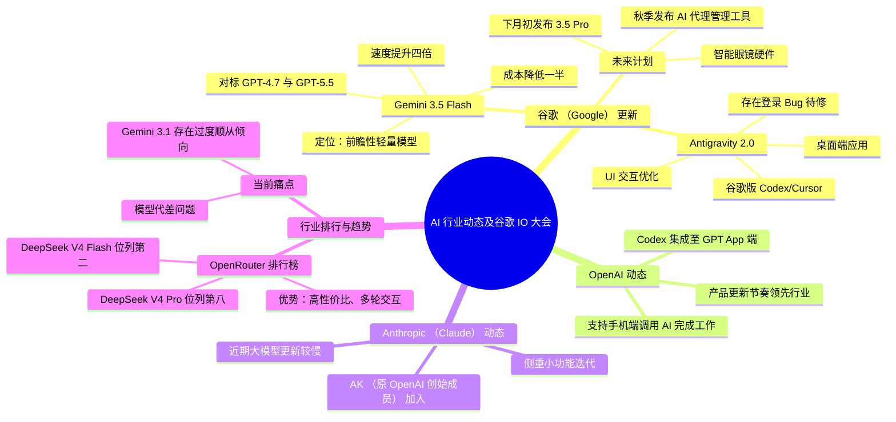

## 图谱（Obsidian 预览中打开）

```mermaid
mindmap
root((AI 行业动态及谷歌 IO 大会))
  谷歌 （Google） 更新
    Gemini 3.5 Flash
      速度提升四倍
      成本降低一半
      对标 GPT-4.7 与 GPT-5.5
      定位：前瞻性轻量模型
    Antigravity 2.0
      谷歌版 Codex/Cursor
      桌面端应用
      UI 交互优化
      存在登录 Bug 待修
    未来计划
      下月初发布 3.5 Pro
      智能眼镜硬件
      秋季发布 AI 代理管理工具
  OpenAI 动态
    Codex 集成至 GPT App 端
    支持手机端调用 AI 完成工作
    产品更新节奏领先行业
  Anthropic （Claude） 动态
    AK （原 OpenAI 创始成员） 加入
    近期大模型更新较慢
    侧重小功能迭代
  行业排行与趋势
    OpenRouter 排行榜
      DeepSeek V4 Flash 位列第二
      DeepSeek V4 Pro 位列第八
      优势：高性价比、多轮交互
    当前痛点
      模型代差问题
      Gemini 3.1 存在过度顺从倾向
```

## 与 Wiki 的链接

<!-- Stage C 完成后自动补充 wikilinks -->
