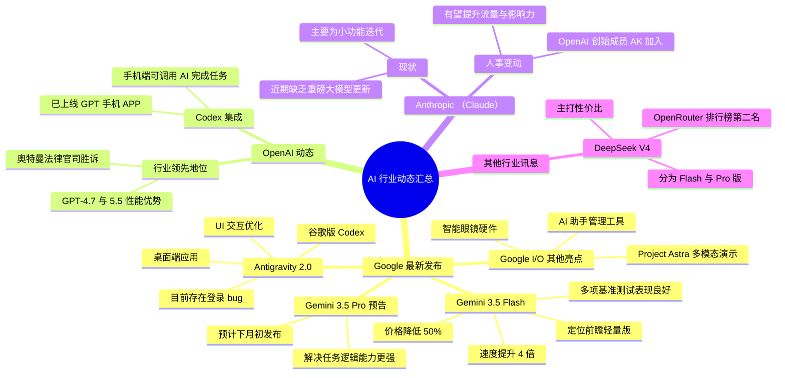

## 图谱（Obsidian 预览中打开）

```mermaid
mindmap
root((AI 行业动态汇总))
  Google 最新发布
    Gemini 3.5 Flash
      速度提升 4 倍
      价格降低 50%
      多项基准测试表现良好
      定位前瞻轻量版
    Antigravity 2.0
      谷歌版 Codex
      桌面端应用
      UI 交互优化
      目前存在登录 bug
    Gemini 3.5 Pro 预告
      预计下月初发布
      解决任务逻辑能力更强
    Google I/O 其他亮点
      Project Astra 多模态演示
      智能眼镜硬件
      AI 助手管理工具
  OpenAI 动态
    Codex 集成
      已上线 GPT 手机 APP
      手机端可调用 AI 完成任务
    行业领先地位
      GPT-4.7 与 5.5 性能优势
      奥特曼法律官司胜诉
  Anthropic （Claude）
    人事变动
      OpenAI 创始成员 AK 加入
      有望提升流量与影响力
    现状
      近期缺乏重磅大模型更新
      主要为小功能迭代
  其他行业讯息
    DeepSeek V4
      OpenRouter 排行榜第二名
      主打性价比
      分为 Flash 与 Pro 版
```

## 与 Wiki 的链接

<!-- Stage C 完成后自动补充 wikilinks -->
