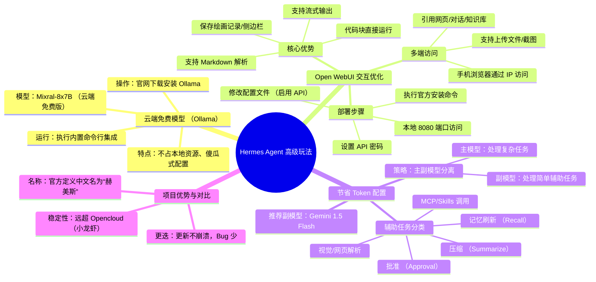

## 图谱（Obsidian 预览中打开）

```mermaid
mindmap
root((Hermes Agent 高级玩法))
  云端免费模型 （Ollama）
    特点：不占本地资源、傻瓜式配置
    操作：官网下载安装 Ollama
    运行：执行内置命令行集成
    模型：Mixral-8x7B （云端免费版）
  Open WebUI 交互优化
    核心优势
      保存绘画记录/侧边栏
      支持 Markdown 解析
      支持流式输出
      代码块直接运行
    部署步骤
      执行官方安装命令
      修改配置文件 （启用 API）
      设置 API 密码
      本地 8080 端口访问
    多端访问
      手机浏览器通过 IP 访问
      支持上传文件/截图
      引用网页/对话/知识库
  节省 Token 配置
    策略：主副模型分离
      主模型：处理复杂任务
      副模型：处理简单辅助任务
    辅助任务分类
      批准 （Approval）
      压缩 （Summarize）
      记忆刷新 （Recall）
      MCP/Skills 调用
      视觉/网页解析
    推荐副模型：Gemini 1.5 Flash
  项目优势与对比
    稳定性：远超 Opencloud （小龙虾）
    更迭：更新不崩溃，Bug 少
    名称：官方定义中文名为“赫美斯”
```

## 与 Wiki 的链接

<!-- Stage C 完成后自动补充 wikilinks -->
