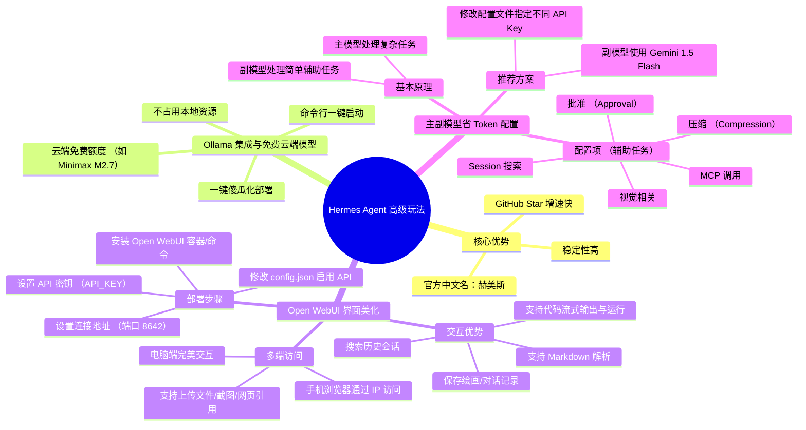

## 图谱（Obsidian 预览中打开）

```mermaid
mindmap
root((Hermes Agent 高级玩法))
  核心优势
    稳定性高
    GitHub Star 增速快
    官方中文名：赫美斯
  Ollama 集成与免费云端模型
    一键傻瓜化部署
    云端免费额度 （如 Minimax M2.7）
    不占用本地资源
    命令行一键启动
  Open WebUI 界面美化
    交互优势
      保存绘画/对话记录
      支持 Markdown 解析
      支持代码流式输出与运行
      搜索历史会话
    部署步骤
      安装 Open WebUI 容器/命令
      修改 config.json 启用 API
      设置 API 密钥 （API_KEY）
      设置连接地址 （端口 8642）
    多端访问
      电脑端完美交互
      手机浏览器通过 IP 访问
      支持上传文件/截图/网页引用
  主副模型省 Token 配置
    基本原理
      主模型处理复杂任务
      副模型处理简单辅助任务
    配置项 （辅助任务）
      批准 （Approval）
      压缩 （Compression）
      MCP 调用
      Session 搜索
      视觉相关
    推荐方案
      副模型使用 Gemini 1.5 Flash
      修改配置文件指定不同 API Key
```

## 与 Wiki 的链接

<!-- Stage C 完成后自动补充 wikilinks -->
